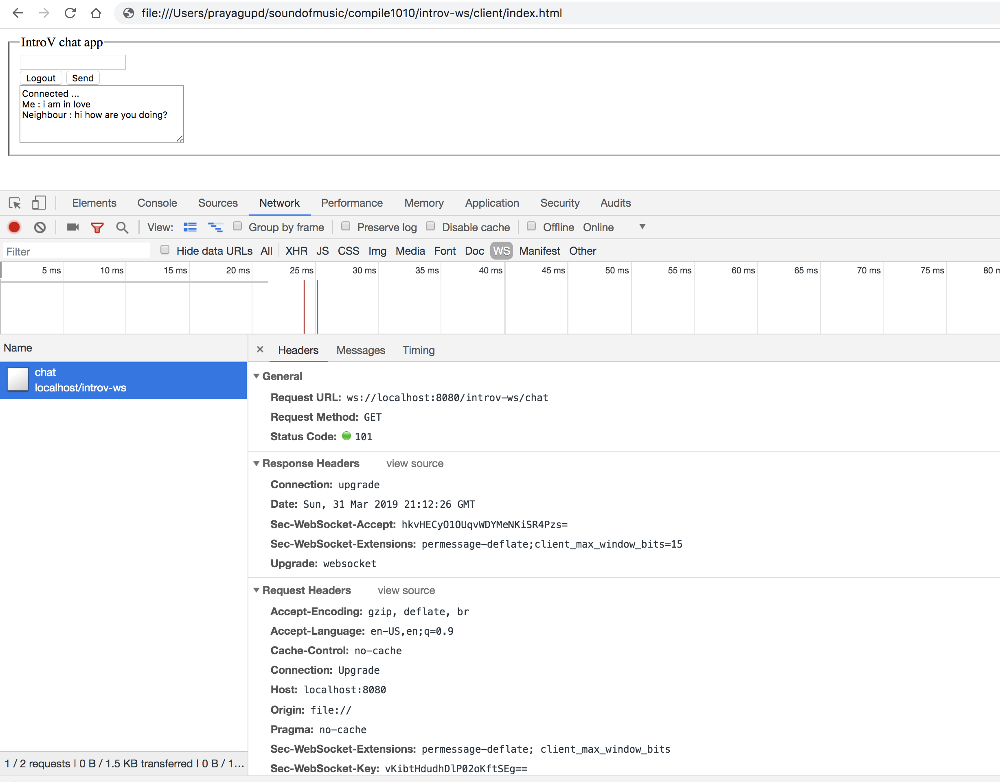

ws client(js)
-------



```bash
31-Mar-2019 13:52:57.834 INFO [Catalina-utility-1] org.apache.catalina.startup.HostConfig.deployWAR Deployment of web application archive [/usr/local/apache-tomcat-9.0.14/webapps/introv-ws.war] has finished in [82] ms
chat session start: 1
chat message session: 1
chat message: I like you
chat session close: 1 ## after refresh
chat session start: 2
```

session will be closed once the tab of a browser is closed.

Also see spring ws server - https://github.com/duwamish-os/chat-server-spring-websocket
